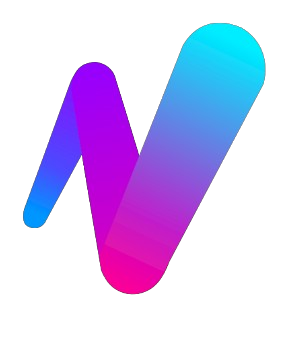

# ⚡️ NextVibe Wallet (Powered by LazorKit)

<p align="center">
  
</p>

> **"Sending crypto should be as easy as sending a text message."**

NextVibe Wallet is a next-gen SocialFi wallet built on Solana, featuring **Gasless Transactions**, **Biometric Security**, and **Seedless Onboarding** via the LazorKit SDK.

---

### 🚀 Production Showcase: NextVibe x LazorKit
This represents a **Real-World Integration** of LazorKit SDK.

* **Status:** Live Beta (Android)
* **Adoption:** **100+ Active Beta Users** on mainnet/devnet.
* **Goal:** NextVibe is scaling to be the first major SocialFi app fully powered by LazorKit's gasless infrastructure in Vietnam & Nigeria.
* **Links:** [Website](https://nextvibe.io) | [Twitter/X](https://x.com/NextVibeWeb3) 

<div align="center">

[](https://x.com/NextVibeWeb3/status/2010439836289929726?s=20)
&nbsp;&nbsp;
[](https://media.nextvibe.io/NextVibeWallet.apk)

</div>

> **Note for Judges:** Since this demo runs on Solana Devnet via the LazorKit Relayer, transaction success may depend on network stability/relayer uptime. If transactions fail, please refer to the video demo above. > 
> ⚠️ This project was submitted on **January 14th**. The recent commits (January 18th) are **strictly for dependency resolution** to ensure the project runs smoothly for judging.
>
> No new business logic or features were added after the deadline.
> * **Proof of Work:** Please check the [Video Demo timestamp on X](https://x.com/NextVibeWeb3/status/2010439836289929726?s=20) (posted before deadline (11 jan)).
> * **Reason for Update:** The original submission had `npm` version conflicts that prevented a clean build. We re-initialized the repository structure to fix this for you.

---

## 🛠 Installation & Quick Start

This repository is a standardized Expo module demonstrating the integration.

### Prerequisites
* Node.js & npm/yarn
* Expo CLI (`npm install -g expo-cli`)
* EAS CLI (`npm install -g eas-cli`) - *Recommended for native modules*

### 1. Clone & Install
```bash
git clone https://github.com/hardusss/NextVibe-LazorKit.git
cd NextVibe-LazorKit
npm install
```

## 2. Build & Run (Recommended Flow)

Since LazorKit utilizes native modules for Secure Enclave access, we highly recommend creating a Development Build instead of using Expo Go.

## Option A: Create Development Build (Best Experience) This creates a custom client compatible with all native libraries.

```bash

eas build --profile development --platform android
# Install the resulting APK on your device/emulator
npx expo start --dev-client
```

## Option B: Local Compile If you have Android Studio configured:
```bash

npx expo run:android
```

## 👨‍💻 Integration Tutorials

Our module provides high-level abstractions so you don't have to deal with low-level Solana RPC calls manually. Here is how to use our hooks and services in your own components.

### 1. Displaying Wallet Data (`usePortfolio`)
Instead of manually managing connection states and fetching logic, simply import `usePortfolio` inside any component. It automatically syncs with the LazorKit session.

**Example: Building a Dashboard Component**

```tsx
import React from 'react';
import { View, Text, FlatList, RefreshControl } from 'react-native';
import usePortfolio from '@/hooks/usePortfolio';

export default function WalletDashboard() {
  // 1. One-line hook to get all real-time data
  const { data, isLoading, refresh } = usePortfolio();

  return (
    <View style={{ flex: 1 }}>
      {/* 2. Access Total Balance easily */}
      <Text style={{ fontSize: 32 }}>
        ${data.totalUsdBalance.toFixed(2)}
      </Text>

      {/* 3. Render Token List */}
      <FlatList
        data={data.tokens}
        keyExtractor={(item) => item.symbol}
        refreshControl={
          <RefreshControl refreshing={isLoading} onRefresh={refresh} />
        }
        renderItem={({ item }) => (
          <View>
            <Text>{item.name}</Text>
            <Text>{item.amount} {item.symbol}</Text>
          </View>
        )}
      />
    </View>
  );
}
```

### 2. Creating Transfers (SolanaService)

We built a facade class SolanaService that handles the complexity of creating instructions. It automatically detects if a transfer is SOL or SPL, and creates Associated Token Accounts (ATA) if needed.

**Example: Logic inside a "Send Screen"**
```tsx
import { useWallet } from '@lazorkit/wallet-mobile-adapter';
import SolanaService from '@/src/services/SolanaService';

const handleSendPress = async (recipient: string, amount: number) => {
  const { connection, smartWalletPubkey } = useWallet();

  // 1. Generate Instructions (No manual SystemProgram calls needed)
  // Pass 'null' as the last argument for SOL, or a Mint Address for tokens.
  const instructions = await SolanaService.createTransferInstructions(
      connection,
      smartWalletPubkey.toString(), // Sender (LazorKit Wallet)
      recipient,                    // Recipient
      amount,                       // Amount
      "4zMMC9srt5Ri5X14GAgXhaHii3GnPAEERYPJgZJDncDU" // Example: USDC Mint
  );

  // 2. The instructions are now ready to be signed by LazorKit
};
```
## 🧪 Usage Scenarios

Here are the 3 main user flows implemented in this wallet:

### 1️⃣ Zero-Friction Onboarding (Seedless)
* **User Action:** Opens the app for the first time.
* **System:** Instead of showing a 12-word seed phrase, the app requests Biometric Authentication (FaceID/TouchID) via LazorKit Enclave.
* **Result:** A secure Solana wallet is generated instantly. The private key never leaves the device's secure hardware.

### 2️⃣ Gasless Transactions (The "Magic" Flow)
* **User Action:** Wants to send 5 USDC but has 0 SOL for gas fees.
* **Process:** User selects token → Enters address → Swipes "Swipe to Send".
* **System:** The transaction is signed locally and sent to a Relayer. The Relayer pays the SOL fee.
* **Result:** Transaction confirmed in <2 seconds. No friction for the user.

### 3️⃣ Real-Time Portfolio & History
* **User Action:** Checks the dashboard.
* **System:** `usePortfolio` hook fetches live balances directly from Solana RPC + token prices via NextVibe API, which uses CoinGecko.
* **Action:** Taps "History".
* **System:** `TransactionParser` decodes raw chain data into human-readable format ("Sent 5 USDC to ...").

---

## 🏗️ Architecture

The project is organized in a simplified way for easy navigation:

```bash
root/
├── app/                      # 🚏 Expo Router / Routes
│   └── (tabs)                # Main app tab layout
│       ├── _layout.tsx       # Tab Bar configuration
│       ├── index.tsx         # Entry point
│       ├── wallet-dash.tsx   # Dashboard route
│       ├── wallet-init.tsx   # Onboarding route
│       ├── transaction.tsx   # Send flow route
│       ├── deposit.tsx       # Receive flow route
│       ├── transactions.tsx  # History route
│       ├── transaction-detail.tsx # Transaction details
│       ├── result-transaction.tsx # Transaction result (success/fail)
│       └── select-token.tsx  # Token selection
│
├── screens/                  # 🧠 Screens with business logic
│   ├── DashboardScreen.tsx
│   ├── WalletIntroScreen.tsx
│   ├── CreateTransactionScreen.tsx
│   ├── ResultTransactionScreen.tsx
│   ├── TransactionsHistoryScreen.tsx
│   ├── TransactionDetailScreen.tsx
│   ├── DepositScreen.tsx
│   └── SelectTokenScreen.tsx
│
├── components/               # 🧩 UI components
│   ├── Wallet/               # Dashboard, Transaction, WalletIntro, Deposit, SelectToken, TransactionsHistory
│   └── Shared/               # Toasts (Web3Toast), Loaders
│
├── hooks/                    # 🎣 Custom React Hooks
│   ├── usePortfolio.ts       # Fetch SOL/SPL balances + prices via NextVibe API (CoinGecko)
│   ├── useTransaction.ts     # LazorKit signing logic
│   ├── useTransactionForm.ts # Form state management
│   ├── useActiveToken.ts     # Token selection state
│   └── useLastTransaction.ts # Transaction history management
│
├── src/                      # ⚙️ Core logic & services
│   ├── services/             # SolanaService.ts
│   ├── api/                  # get.tokens.price.ts (NextVibe API + CoinGecko)
│   ├── types/                # TypeScript interfaces (solana.ts)
│   └── utils/                # Helper functions
│       ├── solana/           # transactionUtils.ts, transactionParser.ts, formatValue.ts
│       └── url_api.ts
│
├── constants/                # 📦 Static data (Tokens.ts)
├── styles/                   # 🎨 Styles
├── scripts/                  # Utilities (reset-project.js)
├── assets/                   # Logo, icons, Lottie animations
└── app.json, package.json, babel.config.js, expo-env.d.ts, README.md
```
# 🔮 Future Roadmap: NextVibe x LazorKit

This project is a wallet module designed to integrate with the **NextVibe SocialFi App** (currently in beta). If this Bounty is successful, we plan to fully integrate it into the main application.

## Next Technical Challenges

- 🔗 **Account Binding**  
  Linking the anonymous LazorKit wallet address to the user's NextVibe social profile, bridging **Web2 + Web3 identity**.

- 📧 **Social Recovery**  
  Implementing a recovery mechanism via **Email or Trusted Contacts** (Multi-Factor Recovery), ensuring users never lose access to their funds even if they lose their device.

- 📱 **Native Integration**  
  Resolving current **native module conflicts** to merge this isolated wallet module back into the main React Native codebase.

  <p align="center"> Built with ❤️ by the NextVibe Team for the LazorKit Bounty. </p>

## ⚖️ License & Copyright

This project is submitted for the LazorKit Bounty.

* **Source Code:** The logic, hooks, and LazorKit integration examples are licensed under the **MIT License** — feel free to use them in your own projects!
* **Assets & Brand:** The **NextVibe** name, logo, and visual identity are proprietary and **Copyright © 2026 NextVibe Team**. They may not be used in commercial projects without permission.