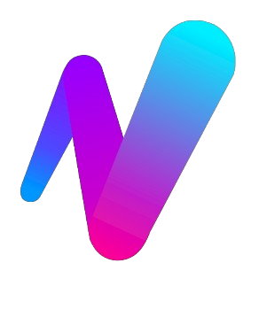

# ⚡️ NextVibe Wallet (Powered by LazorKit)

<p align="center">
  
</p>

> **"Sending crypto should be as easy as sending a text message."**

NextVibe Wallet is a next-gen SocialFi wallet built on Solana, featuring **Gasless Transactions**, **Biometric Security**, and **Seedless Onboarding** via the LazorKit SDK.

---

## ⚠️ IMPORTANT: Submission Notice

**Please read this before running the code.**

This repository is a **clean extraction** of the wallet module from the main NextVibe codebase, created specifically for the LazorKit Bounty submission.

Due to version mismatches encountered while migrating dependencies (specifically between Expo SDK 53/54 and specific package versions) to this new isolated environment, **the local build currently fails with dependency conflicts.**

However, the logic and code structure are complete and correct. To allow you to test the functionality immediately without fighting npm errors, we have provided a working Preview Build from the original environment.

**For the best judging experience:**

### 🎥 1. Video Demo (Recommended)
See the full flow: Onboarding → FaceID → Gasless Transaction.

**[👉 Click here to watch the demo on X](https://x.com/NextVibeWeb3/status/2010439836289929726?s=20)**

### 📱 2. Preview APK (Working Build)
Test the app directly on your Android device.
**[📥 Download Preview APK](https://media.nextvibe.io/NextVibeWallet.apk)**

---

## 🧪 Usage Scenarios

Here are the 3 main user flows implemented in this wallet:

### 1️⃣ Zero-Friction Onboarding (Seedless)
* **User Action:** Opens the app for the first time.
* **System:** Instead of showing a 12-word seed phrase, the app requests Biometric Authentication (FaceID/TouchID) via LazorKit Enclave.
* **Result:** A secure Solana wallet is generated instantly. The private key never leaves the device's secure hardware.

### 2️⃣ Gasless Transactions (The "Magic" Flow)
* **User Action:** Wants to send 5 USDC but has 0 SOL for gas fees.
* **Process:** User selects token → Enters address → Swipes "Swipe to Send".
* **System:** The transaction is signed locally and sent to a Relayer. The Relayer pays the SOL fee.
* **Result:** Transaction confirmed in <2 seconds. No friction for the user.

### 3️⃣ Real-Time Portfolio & History
* **User Action:** Checks the dashboard.
* **System:** `usePortfolio` hook fetches live balances directly from Solana RPC + token prices via NextVibe API, which uses CoinGecko.
* **Action:** Taps "History".
* **System:** `TransactionParser` decodes raw chain data into human-readable format ("Sent 5 USDC to ...").

---

## 🏗️ Architecture

The project is organized in a simplified way for easy navigation:

```bash
root/
├── app/                      # 🚏 Expo Router / Routes
│   └── (tabs)                # Main app tab layout
│       ├── _layout.tsx       # Tab Bar configuration
│       ├── index.tsx         # Entry point
│       ├── wallet-dash.tsx   # Dashboard route
│       ├── wallet-init.tsx   # Onboarding route
│       ├── transaction.tsx   # Send flow route
│       ├── deposit.tsx       # Receive flow route
│       ├── transactions.tsx  # History route
│       ├── transaction-detail.tsx # Transaction details
│       ├── result-transaction.tsx # Transaction result (success/fail)
│       └── select-token.tsx  # Token selection
│
├── screens/                  # 🧠 Screens with business logic
│   ├── DashboardScreen.tsx
│   ├── WalletIntroScreen.tsx
│   ├── CreateTransactionScreen.tsx
│   ├── ResultTransactionScreen.tsx
│   ├── TransactionsHistoryScreen.tsx
│   ├── TransactionDetailScreen.tsx
│   ├── DepositScreen.tsx
│   └── SelectTokenScreen.tsx
│
├── components/               # 🧩 UI components
│   ├── Wallet/               # Dashboard, Transaction, WalletIntro, Deposit, SelectToken, TransactionsHistory
│   └── Shared/               # Toasts (Web3Toast), Loaders
│
├── hooks/                    # 🎣 Custom React Hooks
│   ├── usePortfolio.ts       # Fetch SOL/SPL balances + prices via NextVibe API (CoinGecko)
│   ├── useTransaction.ts     # LazorKit signing logic
│   ├── useTransactionForm.ts # Form state management
│   ├── useActiveToken.ts     # Token selection state
│   └── useLastTransaction.ts # Transaction history management
│
├── src/                      # ⚙️ Core logic & services
│   ├── services/             # SolanaService.ts
│   ├── api/                  # get.tokens.price.ts (NextVibe API + CoinGecko)
│   ├── types/                # TypeScript interfaces (solana.ts)
│   └── utils/                # Helper functions
│       ├── solana/           # transactionUtils.ts, transactionParser.ts, formatValue.ts
│       └── url_api.ts
│
├── constants/                # 📦 Static data (Tokens.ts)
├── styles/                   # 🎨 Styles
├── scripts/                  # Utilities (reset-project.js)
├── assets/                   # Logo, icons, Lottie animations
└── app.json, package.json, babel.config.js, expo-env.d.ts, README.md